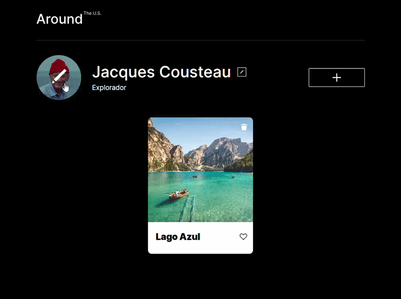
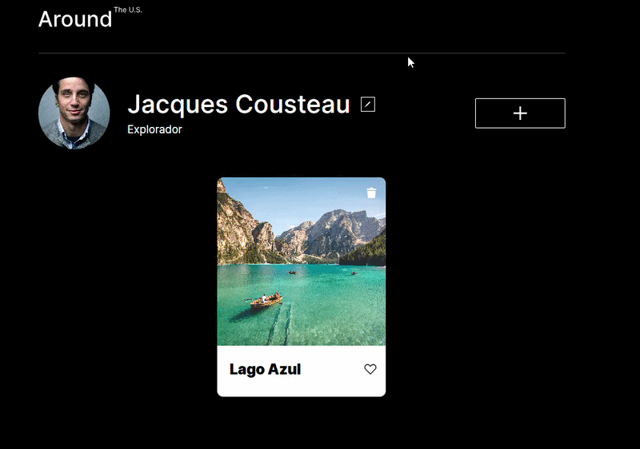
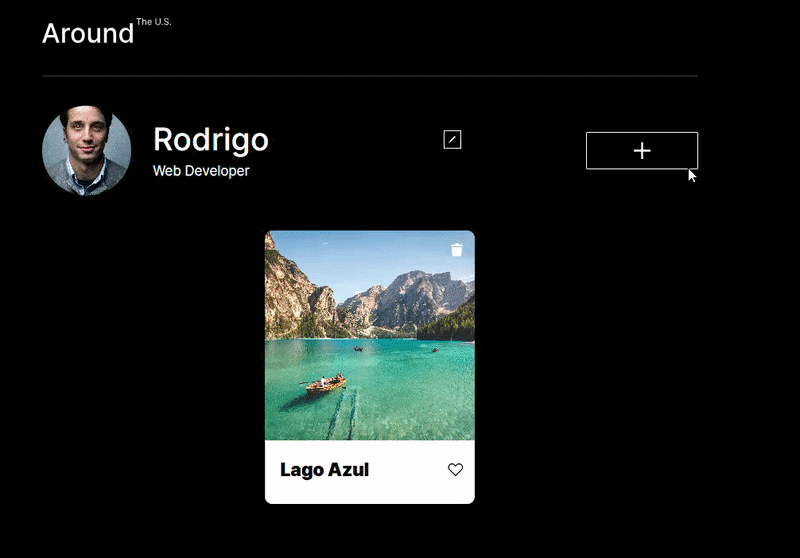
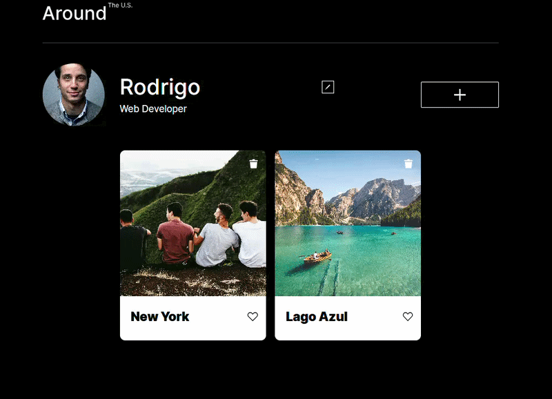

# Around The U.S.

## Live Demo

https://rodrigomzanetti.github.io/web_project_around_pt/

## Preview

  <h3>Change avatar</h3>
    
    
  <h3>Cards interactions</h3>
    
    

## Overview

Around The U.S. is a responsive front-end web application that simulates a travel-based social platform. Users can create, edit, and manage image cards with titles, representing memorable places and experiences.

The project focuses on responsive design, component-based architecture, and dynamic DOM manipulation using vanilla JavaScript.

## Features

- Responsive and clean user interface
- Semantic HTML structure
- Dynamic card creation and DOM manipulation
- Interactive UI with event-driven behavior
- Popup forms for editing profile and adding new cards
- Modular and scalable code organization

## Technologies Used

- HTML5 – semantic structure and content organization
- CSS3 – responsive layout and styling
- JavaScript (Vanilla JS) – DOM manipulation and interactivity
- BEM methodology – modular CSS architecture

## Project Structure

web_project_around_pt/

- blocks/ – modular CSS files organized using BEM methodology
- components/ – JavaScript modules responsible for UI logic
- pages/ – entry styles and scripts
- images/ – image assets
- vendor/ – external resources (normalize.css and fonts)
- fonts/ – project font files
- index.html – main application markup

## How to Run the Project

- Clone the repository
  git clone https://github.com/RodrigoMZanetti/web_project_around_pt.git

- Navigate to the project folder
  cd web_project_around_pt

- Open the project
  Open **index.html** in your browser or run a local server (recommended).

## Status

Completed as part of front-end development training.

## Problem Solving

One of the main challenges in this project was managing dynamic DOM updates when users create new cards. This was solved by organizing reusable JavaScript functions and separating responsibilities between UI components and DOM logic.

Another challenge involved maintaining a consistent responsive layout across multiple screen sizes. This was addressed using modular CSS blocks and structured layout rules.

## What I Learned

During this project I practiced:

- DOM manipulation and dynamic content rendering
- Event handling and interactive UI logic
- Responsive layout techniques using CSS
- Component-based project organization
- Using the BEM methodology for scalable CSS
- Structuring front-end projects for maintainability

## Author

Rodrigo M. Zanetti

GitHub: https://github.com/RodrigoMZanetti

LinkedIn:  
https://www.linkedin.com/in/rodrigomzanetti
